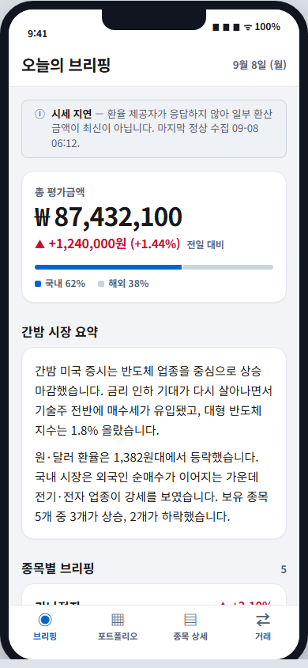
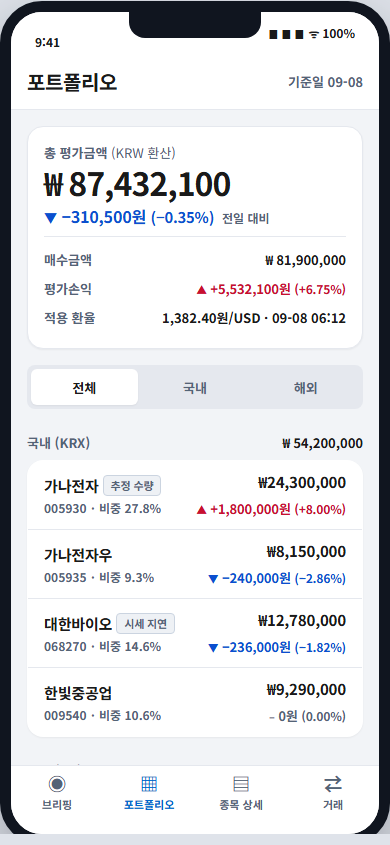
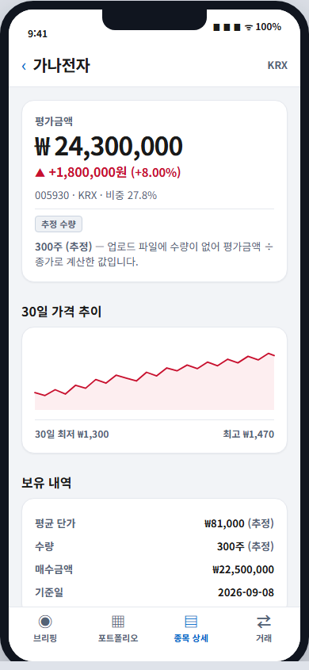
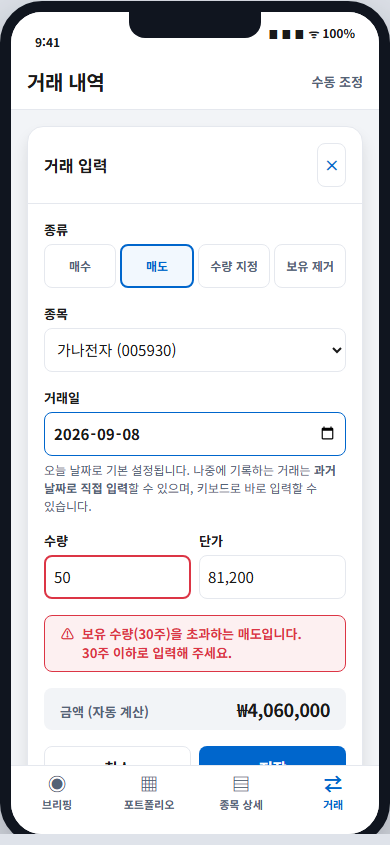

[English](README.md)

# Portfolio Pulse

한국(KRX)과 미국 주식을 통합해서 관리하는 개인용, 1인 사용자, 모바일 최적화
웹 앱입니다. 밤사이 보유 종목에 영향을 준 이슈를 요약해주는 Gemini 기반
일일 뉴스 브리핑 기능을 제공합니다. 개인적·교육적 용도로 만들어졌으며,
상업용 제품이 아니고 투자 조언도 아닙니다.

## 화면 구성

- **오늘의 브리핑** (`/`) — 일일 포트폴리오 스냅샷(평가금액 대비 매입원가)과
  보유 종목 관련 뉴스를 AI가 요약해서 보여줍니다.
- **포트폴리오** (`/portfolio`) — 비중과 손익을 포함한 전체 보유 종목 목록.
- **보유 종목 상세** (`/holdings/[securityId]`) — 종목별 포지션, 거래 내역,
  관련 뉴스.
- **거래 내역** (`/transactions`) — 매수/매도/조정 내역 원장으로, 수동 입력
  및 수정을 지원합니다.
- **업로드** (`/upload`) — 삼성증권 거래내역 파일(`.xlsx`)을 가져와 거래
  내역을 일괄 등록합니다.

### 미리보기

승인된 디자인 알파 목업(`docs/mockups/alpha-v1.html`)에서 캡처한 화면입니다 —
표시된 종목명, 가격, 수치는 전부 가상의 예시 데이터이며 실제 보유 종목이
아닙니다.

<p>
  
  
  
  
</p>

## 기술 스택

- [Next.js 15](https://nextjs.org/) (App Router) + TypeScript
- [Drizzle ORM](https://orm.drizzle.team/)을 통한 [Neon](https://neon.tech/) 서버리스 Postgres
- API/데이터 경계에서의 런타임 검증을 위한 [Zod](https://zod.dev/)
- [Auth.js](https://authjs.dev/) (Google 프로바이더), 허용된 계정 1개로만 접근 제한
- Oracle Cloud Always Free VM에 직접 호스팅 (Nginx + Let's Encrypt + PM2)

핵심 스택 선택의 배경에 대해서는
[`docs/adr/0001-tech-stack-nextjs-vercel-postgres.md`](docs/adr/0001-tech-stack-nextjs-vercel-postgres.md)를,
인증 관련 결정은
[`docs/adr/0005-google-oauth-single-user-access.md`](docs/adr/0005-google-oauth-single-user-access.md)를,
호스팅 관련 결정은
[`docs/adr/0006-self-hosted-oracle-cloud-deployment.md`](docs/adr/0006-self-hosted-oracle-cloud-deployment.md)를,
아키텍처 결정 기록 전체는 [`docs/adr/`](docs/adr/)를 참고하세요.

## 데이터 소스

모든 외부 데이터는 단일 프로바이더 게이트웨이를 통해 서버 사이드에서
가져옵니다
(자세한 내용은 [`docs/adr/0002-server-side-provider-gateway.md`](docs/adr/0002-server-side-provider-gateway.md) 참고):

- **KRX 오픈API** — 한국 시장/거래소 데이터
- **DART OpenAPI** — 한국 기업 공시 정보
- **한국은행 ECOS** — 한국 거시경제 지표
- **Finnhub** — 미국 시장 데이터 및 뉴스
- **FMP (Financial Modeling Prep)** — 미국 기업 펀더멘털 데이터
- **네이버 검색 API** — 한국 뉴스 검색
- **Gemini API** — 뉴스 분석 및 일일 브리핑 생성
- **삼성증권 거래내역 수동 업로드** (`.xlsx`) — 거래 내역을 일괄로 가져올 수
  있는 유일한 방법이며, 실시간 증권사 연동 기능은 없습니다

## 설치 방법

```bash
bun install
cp .env.sample .env   # DATABASE_URL과 아래 API 키들을 채워 넣으세요
bun run db:generate
bun run db:migrate
bun run dev
```

본인 소유의 Neon(또는 다른 Postgres 호환) 데이터베이스와 KRX, DART, ECOS,
Finnhub, FMP, 네이버 검색, Gemini용 API 키가 각각 필요합니다. 또한 Google
OAuth Client ID/Secret(Google Cloud Console → APIs & Services →
Credentials)이 필요하며, `ALLOWED_GOOGLE_EMAIL`을 본인 계정으로 설정해야
합니다. 필수 및 선택 환경 변수의 전체 목록은 `.env.sample`을 참고하세요.

## 배포

관리형 플랫폼 대신 직접 관리하는 Oracle Cloud Always Free VM에 배포되어
있습니다 (Nginx 리버스 프록시, Let's Encrypt TLS, PM2 프로세스 관리, 일일
브리핑 작업용 시스템 크론). 설정 과정과 트레이드오프는
[ADR-0006](docs/adr/0006-self-hosted-oracle-cloud-deployment.md)을
참고하세요.

## 테스트

```bash
bun run test:app
```

## 라이선스

이 프로젝트는 [GNU AGPL-3.0](LICENSE) 라이선스를 따릅니다.

이 프로젝트는 원래 마찬가지로 AGPL-3.0 라이선스를 따르는
[ai-workspace-standards](https://github.com/5throck/ai-workspace-standards)
툴킷으로부터 스캐폴딩되었습니다. 이 저장소에는 애플리케이션 자체만
포함되어 있으며, 개발에 사용된 멀티 에이전트 스캐폴딩(에이전트, 스킬,
자동화 스크립트, 세션 로그)은 포함되어 있지 않습니다.

## 면책 조항

이 프로젝트는 개인적·교육적 목적의 프로젝트입니다. 금융 또는 투자 조언이
아니며, 어떠한 보증도 제공하지 않습니다. 이용에 따른 책임은 전적으로
사용자 본인에게 있습니다.
